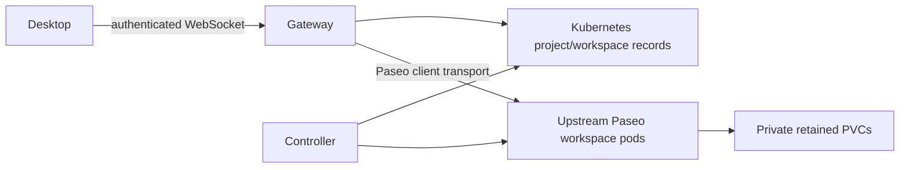

# Architecture

The service contains two modules: a controller that reconciles small Kubernetes
records and a gateway that exposes Paseo's direct WebSocket protocol. Keeping the
boundary at Kubernetes records allows a future Go controller without requiring
a private gateway/controller RPC service now.

Both CRDs use the repository-owner API group `paseo-gateway.manziman.github.io`.
The project is independent and is not affiliated with or endorsed by Paseo.

`PaseoProject` stores repository configuration and exists without a workspace.
`PaseoWorkspace` stores desired residency, project and credential references.
Its status contains readiness, conditions and a PVC reference. No transcripts,
tokens or per-RPC journals belong in these objects. Host identity and passwords
live in retained Secrets provisioned separately from the chart.

Reconciliation reads current state every five seconds, serializes operations,
and uses bounded exponential backoff per failing workspace. This is intentionally
a small-cluster implementation. A watch/work queue can replace polling without
changing the reconcile interface. Kubernetes UIDs prevent adopting another
workspace's resources, and status replacement uses resourceVersion conflicts.
Pods and Services are owned by the workspace. PVCs have no owner reference, and
the gateway role cannot delete them. Normal pod deletion is awaited before the
same named pod can be recreated. The controller never force-deletes pods.

Each client connection owns separate backend connections and terminal-slot
mappings. The exported `@getpaseo/client` transport adapter supplies upstream
handshake/liveness behavior. The gateway uses the exported wire schemas to
validate messages and the upstream codecs for binary frames. Workspace-agent
IDs encode the retained workspace name and backend ID reversibly. Filesystem
mounts are unique (`/workspaces/<id>`), because some unchanged client views key
by host and working directory rather than workspace ID.

Directory caches are disposable. Each gateway start allocates a new generation;
directory fetches provide authoritative snapshots. Failed backend inventory
queries fail the request rather than claim the missing inventory was deleted.
Suspended inventory is explicitly unavailable until compute is resumed.
There is no gateway data volume, external database or durable event journal.

Backend mutations are sent once. A lost response is an unknown outcome, not an
invitation to retry. Gateway replacement leaves provider processes running;
workspace replacement retains storage but can interrupt a turn. Built-in
agent-originated Paseo tools are disabled in this POC because upstream does not
export a complete federation authority hook. Their cluster-authoritative
replacement remains a v0.1 feasibility requirement.

## Sources behind the design

- [Kubernetes controller model](https://kubernetes.io/docs/concepts/architecture/controller/)
- [Custom resource conventions](https://kubernetes.io/docs/concepts/extend-kubernetes/api-extension/custom-resources/)
- [RBAC least privilege](https://kubernetes.io/docs/concepts/security/rbac-good-practices/)
- [Persistent volumes and access modes](https://kubernetes.io/docs/concepts/storage/persistent-volumes/)
- [Container security contexts](https://kubernetes.io/docs/tasks/configure-pod-container/security-context/)
- [NetworkPolicy enforcement prerequisites](https://kubernetes.io/docs/concepts/services-networking/network-policies/)
- [Paseo architecture at the inspected commit](https://github.com/getpaseo/paseo/blob/3e59adb4dcea119e2ce281852fd0f6d4afbb8684/docs/architecture.md)
- [Docker Desktop containerd image store](https://docs.docker.com/desktop/features/containerd/)
- [Docker Desktop Kubernetes provisioner compatibility](https://docs.docker.com/desktop/use-desktop/kubernetes/)
- [GitHub Actions secure use](https://docs.github.com/en/actions/reference/security/secure-use)

Go-specific style and tooling do not apply to this TypeScript implementation.
Framework conveniences are not substitutes for the Kubernetes lifecycle and
security contracts above.
