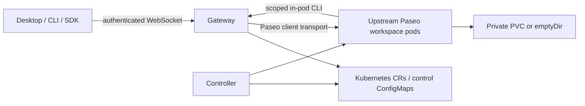

# Architecture

One TypeScript service contains the protocol gateway, workspace controller,
scheduler and credential broker. Kubernetes records provide durable authority;
provider processes remain inside separate upstream daemon pods. There is no
internal microservice protocol or Redis dependency.

All three CRDs use the repository-owner API group `paseo-gateway.manziman.github.io`.
The project is independent and is not affiliated with or endorsed by Paseo.

`PaseoProject` stores repository configuration and exists without a workspace.
`PaseoWorkspace` stores desired residency, project and credential references.
`PaseoCredentialProfile` describes Secret/ConfigMap projections, Git identity,
optional GitHub App renewal and runtime overrides. Workspace status contains
readiness, failure diagnostics, retention progress and a PVC reference. No transcripts,
tokens or per-RPC journals belong in these objects. Host identity and passwords
live in retained Secrets provisioned separately from the chart.

Reconciliation reads current state every five seconds, serializes operations,
and uses bounded exponential backoff per failing workspace. This is intentionally
a small-cluster implementation. A watch/work queue can replace polling without
changing the reconcile interface. Kubernetes UIDs prevent adopting another
workspace's resources, and status replacement uses resourceVersion conflicts.
Pods, Services and scoped access Secrets are owned by the workspace. PVCs have
no owner reference; deletion requires explicit retention expiry, completed
teardown, stopped compute and matching ownership/UID. Normal pod deletion is awaited before the
same named pod can be recreated. The controller never force-deletes pods.

Each client connection owns separate backend connections and terminal-slot
mappings. The exported `@getpaseo/client` transport adapter supplies upstream
handshake/liveness behavior. The gateway uses the exported wire schemas to
validate messages and the upstream codecs for binary frames. Workspace-agent
IDs encode the retained workspace name and backend ID reversibly. Filesystem
mounts are unique (`/workspaces/<id>`), because some unchanged client views key
by host and working directory rather than workspace ID.

Directory caches are disposable. Each gateway start allocates a new generation;
directory fetches provide authoritative snapshots. Failed backend inventory
queries fail the request rather than claim the missing inventory was deleted.
Suspended inventory is explicitly unavailable until compute is resumed.
Archived metadata has a bounded durable cache, purged when storage retention
expires. ConfigMaps also store schedule definitions/history, creation intents
and sanitized receipts with resourceVersion preconditions. There is no gateway
data volume or external database. These control records are not a replay queue.

Backend mutations are sent once. A lost response is an unknown outcome, not an
invitation to retry. Gateway replacement leaves provider processes running;
workspace replacement retains storage but can interrupt a turn. Modern creation
snapshots let the CLI observe a cold start and reconnect to a durable result.
Interrupted intents report uncertainty and never silently re-dispatch a mutation.
Built-in local agent-spawning tools remain disabled. The in-pod CLI reaches the
gateway with a renewable project/profile grant and creates sibling pods through
the same lifecycle authority. See [authentication](gateway-auth.md),
[schedules](schedules.md), and the [HA decision](ha-design.md).

## Sources behind the design

- [Kubernetes controller model](https://kubernetes.io/docs/concepts/architecture/controller/)
- [Custom resource conventions](https://kubernetes.io/docs/concepts/extend-kubernetes/api-extension/custom-resources/)
- [RBAC least privilege](https://kubernetes.io/docs/concepts/security/rbac-good-practices/)
- [Persistent volumes and access modes](https://kubernetes.io/docs/concepts/storage/persistent-volumes/)
- [Container security contexts](https://kubernetes.io/docs/tasks/configure-pod-container/security-context/)
- [NetworkPolicy enforcement prerequisites](https://kubernetes.io/docs/concepts/services-networking/network-policies/)
- [Pinned Paseo source and protocol](https://github.com/getpaseo/paseo/tree/81865852011df86aa0ad0ae411cb2f5e4078153f)
- [Docker Desktop containerd image store](https://docs.docker.com/desktop/features/containerd/)
- [Docker Desktop Kubernetes provisioner compatibility](https://docs.docker.com/desktop/use-desktop/kubernetes/)
- [GitHub Actions secure use](https://docs.github.com/en/actions/reference/security/secure-use)

Go-specific style and tooling do not apply to this TypeScript implementation.
Framework conveniences are not substitutes for the Kubernetes lifecycle and
security contracts above.
