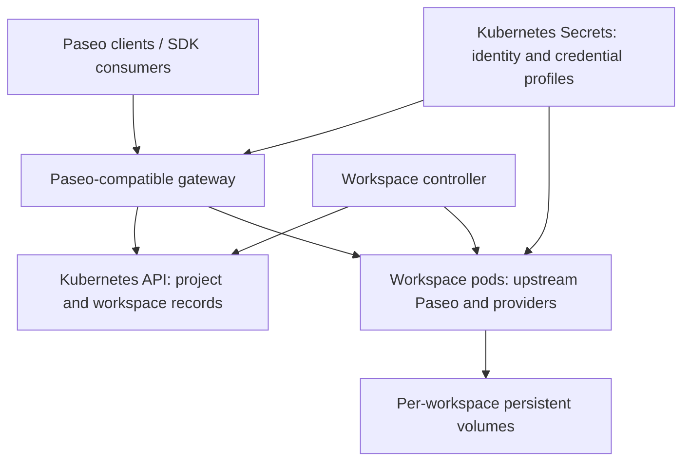

# Paseo Kubernetes: open-source v0.1 specification

Status: proposed scope, with accepted project constraints. Date: 2026-09-17.

## Product and project decisions

Build a standalone open-source project that runs Paseo workspaces on Kubernetes
and exposes them as one host to the existing Paseo desktop/mobile client.
The project has no workflow-engine dependency.
EKS is the initial deployment target; keep AWS-specific settings in deployment
configuration rather than the core execution model.

Accepted constraints:

- Separate repository, release lifecycle, container images and installation chart.
- No maintained Paseo fork and no vendored copy of its daemon implementation.
- Reuse version-pinned Paseo libraries and run the upstream daemon in workspace pods.
- Keep organization-specific workflows and migration outside the project.

Proposed v0.1 simplification: no separately operated database, no gateway data
volume, no durable operation journal and one active gateway instance. Kubernetes
resources and existing workspace volumes hold necessary durable state; gateway
caches are disposable. This is a persistence design, not a claim of zero state.

This repository contains the standalone project specification.
Implementation has not started; it does not add Kubernetes support to upstream Paseo.

## Scope

The project owns the Paseo-compatible cluster host, Kubernetes workspace
lifecycle, generic credential profiles, persistence, reconnect behavior,
SDK/CLI compatibility and deployment documentation.

Consumers own their workflow orchestration, business policies, organization
access controls, integrations and migration from existing infrastructure.
These are not operator dependencies or release acceptance requirements.

## Architecture

Gateway and controller can ship in one deployment initially, with separate
responsibilities. The controller owns desired residency and pod/PVC lifecycle.
The gateway owns host identity, authorization, catalog aggregation and routing.
Workspace daemons own agent execution, conversations, files, Git and terminals.

Use one pod and retained volume per workspace. Begin with one primary agent;
related agents may share a workspace when normal Paseo semantics require it.
Separate credentials or filesystem isolation require separate workspaces.
Do not share writable Paseo homes or Git working trees between unrelated pods.

## Reuse without a fork

Use `@getpaseo/protocol` for wire schemas, `@getpaseo/client` for backend
connections, and exported relay/server helpers where suitable. Pin and test
compatible versions with the workspace daemon image.

The current server exports include daemon bootstrap and selected helpers, not
a complete federation framework. Library reuse does not make aggregation free.
Build Kubernetes-specific routing in this project; do not depend on arbitrary
unexported source files. If a required hook is unavailable, seek an upstream
export/extension or explicitly narrow the release. An unresolved required hook
is a feasibility blocker, not permission to maintain a fork.

## State without a separate database

“Catalog” means the inventory of projects, workspaces and their routing metadata.
It does not require a new SQL database.

| State | v0.1 source of truth |
| --- | --- |
| Project identity and repository configuration, including empty projects | Small Kubernetes project records |
| Workspace identity, project link, desired residency, image/profile and PVC references | Workspace custom resources |
| Pod/service discovery and observed readiness | Kubernetes resources and controller status |
| Stable host identity, pairing key material and sensitive authentication records | Kubernetes Secrets; retain across gateway replacement |
| Small non-sensitive host configuration and persistent access metadata | Kubernetes configuration resources, with a defined owner |
| Agent records, timelines, provider sessions, files and Git | Upstream Paseo state on each workspace PVC |
| Routing lookup, directory projections, subscriptions and connection state | Gateway memory, reconstructed on restart |
| Durable prompt receipts or a cluster event journal | Not provided in v0.1 |

Use logical IDs stored in retained records, never pod IPs or pod names. Derive
agent routing from workspace identity and backend agent identity; validate the
encoding against the unchanged client's accepted ID format. Avoid a separate
mutable ID mapping database.

Keep custom resources small and low-frequency. Do not write streaming tokens,
transcripts, file contents or a record for every RPC into the Kubernetes API.
Agent inventory can be queried from available daemons and cached. After a cold
gateway restart, a suspended/unreachable workspace may need to wake before its
agent inventory can be reconstructed. Show incomplete/unavailable inventory
explicitly; do not interpret a failed query as deletion. Fully offline browsing
of every suspended agent is not a v0.1 promise.

On gateway restart, rebuild the catalog and begin a new directory generation.
Clients must receive an authoritative full snapshot rather than reuse expired
incremental cursors. Paseo already describes generation-based snapshot reset;
compatibility tests must verify the aggregate implementation.

This removes another database to deploy and back up. It does not remove the
need to protect Kubernetes metadata, Secrets and workspace volumes. Losing all
three loses configuration, identities and sessions.

## Paseo client compatibility

Required v0.1 flows:

- Connect to a stable cluster host and reconnect after gateway replacement.
- Select configured projects; create, list and operate multiple workspaces.
- Create/list/inspect/message/stop/archive agents and recover their timelines.
- Route permission replies, file/Git operations and terminal traffic correctly.
- Preserve provider behavior by using real upstream daemons.
- Handle required agent-originated workspace/agent operations through the same
  cluster authority; do not allow untracked workspace creation inside a pod.

Paths are workspace-scoped even if every pod uses `/workspace`. The gateway
must support project selection before a workspace pod exists. Arbitrary browsing
of a host filesystem is outside the configured repository model.

Reuse existing wire contracts and advertise only supported capabilities.
Optional integrations, gateway-managed schedules/heartbeats, active-active
replicas and multi-tenant authorization are deferred. Consumers may schedule
calls externally. Inventory mandatory client RPCs early: a missing capability
flag must not be assumed to hide an unsupported required flow.

Keep a single trusted owner in v0.1, preserve applicable Paseo permissions, and
protect gateway-to-daemon traffic. Relay encryption terminates at the gateway;
it is a trusted endpoint. Workspaces receive no controller credentials.

## Restart and retry contract

Controller reconciliation is idempotent for desired workspace infrastructure.
Use Kubernetes object identity and concurrency controls for resource creation;
this does not make arbitrary agent commands idempotent.

Gateway restart disconnects clients but does not stop running workspace agents.
Pod replacement retains files and history, while the active process/turn may be
interrupted. Report that distinction; neither gateway nor controller submits a
new business prompt to resume work automatically.

If the gateway forwards a create/message request and loses the response, the
outcome is unknown. Do not automatically resend it. Return the normal failure
available through the client protocol, preserve observable backend evidence,
and require inspection/reconciliation before retry. Test actual client reconnect
behavior to ensure it does not silently replay mutations.

No exactly-once execution or transparent retry guarantee is offered in v0.1.
A Kubernetes record alone cannot close the crash window between forwarding a
prompt and recording its result. Durable deduplication can be added later if a
provider/backend acceptance interface supports it; it is not hidden in the
initial scope.

Archive retains storage. Suspend stops compute and retains the workspace.
Deletion of a pod never means deletion of its PVC. Explicit workspace deletion
has a documented retention policy. Prevent concurrent writers during replacement;
do not treat a replica count alone as fencing against every node failure.
Document storage placement constraints and recovery limitations.

## Credentials

Support named credential profiles and Claude/Codex subscription login. Keep
provider session databases, caches and workspace files private to each pod.
Secrets distribute sensitive material; they do not coordinate token refresh.

A shared credential volume remains an implementation candidate, not a proven
renewal solution. Verify concurrent renewal with the actual supported provider
versions, using supported token interfaces or coordinated refresh ownership.
Do not promise that copying auth files makes a safe multi-pod subscription fleet.
API keys can be an additional option but do not replace this requirement.

Credential renewal is an early feasibility gate. If it requires durable state,
use the existing Secret/credential storage mechanism rather than introducing a
catalog database. Never persist credentials or prompt content in ordinary
custom-resource fields or logs.

## v0.1 delivery and acceptance

1. Prove upstream reuse: connect an unchanged client to one workspace daemon,
   test PVC recovery and credential renewal, inventory required exported hooks.
2. Implement controller lifecycle and Kubernetes project/workspace records.
3. Build the aggregate host, disposable catalog cache and required client flows.
4. Test restart, interrupted turns, lost responses, identity retention and restore.
5. Publish the standalone project, installation chart, version compatibility
   matrix and explicit limitations. Verify license/notice obligations for all
   redistributed libraries and images.

Release acceptance uses generic repositories and clients, with no external
workflow-engine dependency. It includes concurrent workspaces, retained identities and
history, gateway replacement while agents continue, reconnect snapshots,
permission handling, credential renewal, and no automatic duplicate dispatch
on ambiguous requests. Validate these claims before labeling v0.1 supported.

## Remaining design questions

- Required upstream exports/extensions for aggregation and agent-originated tools.
- Exact Kubernetes record schemas and identity representation compatible with clients.
- Pairing/access persistence adapter using Secrets and small configuration records.
- Credential refresh mechanism for each provider.
- Storage profiles, supported failure domains and resource/startup budgets.

A database choice and a maintained Paseo fork are no longer open alternatives
for v0.1. If this scope proves insufficient, revise the proposal explicitly.

## Evidence

- Local Paseo [architecture](https://github.com/getpaseo/paseo/blob/3e59adb4dcea119e2ce281852fd0f6d4afbb8684/docs/architecture.md),
  [protocol compatibility](https://github.com/getpaseo/paseo/blob/3e59adb4dcea119e2ce281852fd0f6d4afbb8684/docs/protocol-compatibility.md),
  [permissions](https://github.com/getpaseo/paseo/blob/3e59adb4dcea119e2ce281852fd0f6d4afbb8684/docs/permissions.md), and [Docker](https://github.com/getpaseo/paseo/blob/3e59adb4dcea119e2ce281852fd0f6d4afbb8684/docs/docker.md).
- Current [server exports](https://github.com/getpaseo/paseo/blob/3e59adb4dcea119e2ce281852fd0f6d4afbb8684/packages/server/src/server/exports.ts),
  [client package](https://github.com/getpaseo/paseo/blob/3e59adb4dcea119e2ce281852fd0f6d4afbb8684/packages/client/package.json), and
  [protocol package](https://github.com/getpaseo/paseo/blob/3e59adb4dcea119e2ce281852fd0f6d4afbb8684/packages/protocol/package.json).
- Kubernetes [custom resources](https://kubernetes.io/docs/concepts/extend-kubernetes/api-extension/custom-resources/)
  provide API-managed persistent objects; use them for small declarative records,
  not application streams or a general-purpose database.
- Kubernetes [Secrets](https://kubernetes.io/docs/concepts/configuration/secret/)
  hold sensitive configuration. Access control and encryption configuration remain
  deployment responsibilities; Secret storage alone is not a security guarantee.
